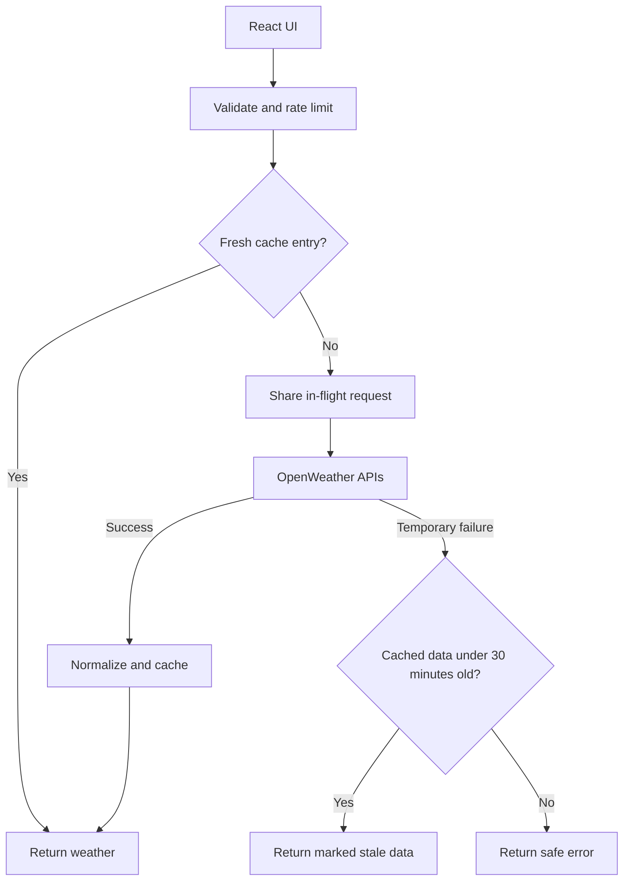

# City Weather

[](https://github.com/ashitamv/Weather-App-with-Cities-Autocomplete-using-APIs/actions/workflows/ci.yml)

A React weather app with a small Express backend, city autocomplete, current conditions, and forecasts grouped by the selected city's local date.

This project began as a frontend weather app. The upgrade fixes forecast interval and unit errors and adds a server-owned API boundary, bounded caching, request coalescing, and explicit failure states.

## Run the demo first

Use Node.js 24 (`.nvmrc`; minimum supported version 22.9) and npm. Run these commands inside the project directory:

```sh
npm ci
npm run build
npm run demo
```

Open **http://localhost:3001**. Search **Hyderabad**, **Bengaluru**, **London**, **Seattle**, or **Tokyo**. The demo uses synthetic weather and displays a label; it requires no provider accounts and makes no external API calls.

For development with hot reload, run `npm run demo` in one terminal and `npm start` in another, then open http://localhost:3000. The React development server proxies `/api` to port 3001.

## Configure live data

The original browser source contained provider credentials. Revoke those exposed keys in the provider accounts and create replacements before enabling live mode. Removing them from the current source does not revoke them or erase Git history.

1. Copy `.env.example` to `.env` in the project root.
2. Set `OPENWEATHER_API_KEY` to a replacement OpenWeather key and `GEODB_API_KEY` to a replacement RapidAPI key with access to GeoDB Cities.
3. Stop the demo server and run `npm run server`.
4. Use `npm start` for development, or build once and run `npm run serve` to serve the UI and API together.

Keep `.env` untracked; do not paste keys into frontend files or variables prefixed with `REACT_APP_`. [Create React App embeds its frontend environment variables in the browser bundle](https://create-react-app.dev/docs/adding-custom-environment-variables/).

The server uses `PORT`, then `API_PORT`, then 3001. If changing the development API port, also change the `proxy` in `package.json`. A deployment must run the Node service; uploading only the static frontend will not provide `/api`.

A visual browser review could not be completed in the build environment; review the desktop and mobile demo before publishing. Live provider calls have not been validated using replacement account credentials. Check city search, current weather, and forecast access with your subscribed plans before publishing a live demo.

## What changed

| Area | Original behavior | Current behavior |
| --- | --- | --- |
| Credentials | Provider keys in browser JavaScript | Server-only environment configuration; browser calls `/api` |
| Forecast dates | First seven three-hour readings labelled as seven days | Available readings grouped by actual city-local calendar date |
| Temperature units | Forecast request omitted metric units while displaying °C | Both weather requests explicitly use metric units |
| Repeated requests | Two weather-provider calls per city selection | Ten-minute weather TTL; 24-hour city-search TTL |
| Concurrent misses | Independent provider calls | Requests for the same location share one in-flight result |
| Provider outage | Console logging | Five-second upstream timeouts, safe error responses, and labelled stale fallback |
| UI requests | An older response could overwrite a newer selection | Cancelled obsolete requests, guarded state updates, loading and retry states |
| Verification | Unmodified starter test | 21 backend tests and 7 UI tests, plus a CI test/build workflow |

OpenWeather's [forecast endpoint provides five days of data in three-hour intervals](https://openweathermap.org/forecast5). A rolling forecast can span portions of six local calendar dates. Ranges are calculated from the available readings; detail panels show the reading nearest local noon. This app does not claim to provide seven daily forecasts. Pressure uses hPa, temperature °C, and wind m/s.

## API

| Endpoint | Input | Response |
| --- | --- | --- |
| `GET /api/health` | None | Process liveness and `live` or `demo` mode |
| `GET /api/cities?q=Hy` | One trimmed search string, 2–80 characters | Up to five `{ label, value }` city options and metadata |
| `GET /api/weather?lat=17.385&lon=78.4867` | One finite latitude and longitude within geographic bounds | Current conditions, forecast groups, city UTC offset, and metadata |

Weather coordinates are normalized to four decimal places before both lookup and provider calls. That is approximately 11 metres in latitude. Weather metadata includes `fetchedAt`, `stale`, `mode`, and `cache` (`miss`, `hit`, `coalesced`, or `stale`). `fetchedAt` means retrieval time, not the provider's observation time; `weather.current.observedAt` retains the observation timestamp.

Error responses contain `error.code` and a safe `error.message`. Invalid input returns 400, client throttling returns 429 with `Retry-After`, and upstream failures return 502/503/504. Health reports process liveness; it does not assert that provider credentials or subscriptions are valid.

## Weather request flow



- Weather data is fresh in cache for ten minutes and may be reused after a transient failure only when its age since retrieval is under 30 minutes. The maximum age is checked after a failed upstream wait. The original retrieval timestamp is preserved.
- A failed refresh with usable cached data backs off for at least ten seconds. Provider 429 responses also establish a host-wide cooldown in that process, using `Retry-After` when supplied, bounded to 1–300 seconds. Calls are not automatically retried.
- Each cache holds at most 256 results and 64 distinct in-flight loads. Eviction bounds stored entries; expiry controls freshness. Current weather and forecast are requested in parallel, validated, and cached together after both succeed.
- API requests are limited to 60 per minute per directly connected client IP using a fixed window. Health is excluded. The client-IP map is bounded to 10,000 entries.
- JSON request logs include a generated request ID, response status, duration, and cache outcome. Raw queries, provider URLs, keys, response bodies, and upstream error messages are not logged.

## Verify and measure

```sh
npm run check
npm run benchmark
```

`check` runs the backend tests, UI tests, and production build. Tests and benchmarks need no API keys. GitHub Actions is configured to run the same checks on pushes and pull requests; a remote CI run is not implied by a local pass.

The benchmark starts a local HTTP server with a simulated provider that delays each call by 50 ms. Every scenario makes 30 requests for the same location. The API rate limit is raised for the benchmark. Each successful uncached weather request needs two provider calls.

Measured on Node 24.19.0, Linux x64; see [the exact result](docs/benchmark.json):

| Scenario | Requests / concurrency | Provider calls | Median HTTP latency | p95 HTTP latency |
| --- | --- | --- | --- | --- |
| Cache disabled | 30 / 1 | 60 | 56.73 ms | 68.25 ms |
| Cache enabled, including first cold request | 30 / 1 | 2 | 2.62 ms | 11.61 ms |
| Cache enabled, concurrent cold start | 30 / 30 | 2 | 95.33 ms | 117.41 ms |

The cached sequential case used one miss and 29 hits. The concurrent case used one miss and 29 coalesced requests. The 60-to-2 call reduction is specific to this repeat-location workload. These are local synthetic measurements, not production latency, internet benchmarks, user traffic, or evidence of distributed scalability. Concurrent callers still wait for the first provider result.

## Deliberate limits and next steps

- Caches, coalescing, provider cooldowns, and rate limits are per process and reset on restart. Multiple instances need shared quota/cache design; no Redis or distributed locking is implemented.
- Express does not trust forwarded IP headers. Behind a reverse proxy, clients share that proxy's limit until the exact trusted proxy configuration is added. Do not turn on blanket proxy trust for a public deployment.
- The client limit does not enforce a provider's account-wide quota across users or instances. Check your provider plan before exposing the service publicly.
- Forecast grouping uses the UTC offset supplied by the provider, not an IANA time-zone database; a future daylight-saving transition is not modelled.
- Create React App was retained for this focused upgrade. It is deprecated and the existing build setup emits dependency warnings. Migrating the build tooling is separate follow-up work.
- Live operation needs replacement credentials and a live smoke test. No public deployment or real-world usage metrics are claimed.

See [the review and interview guide](docs/INTERVIEW.md) for a 90-minute walkthrough, design questions, and resume bullets grounded in the implementation.
